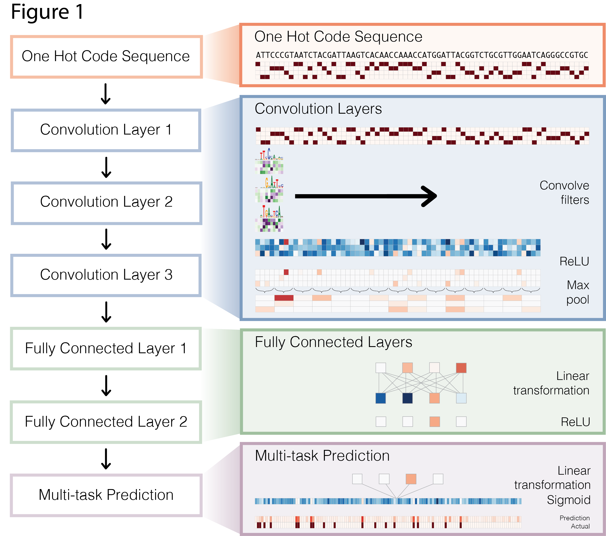

# Accelerated learning of chromatin-centric gene regulation with GPUs

From JC's email:
```
* brief summary of current and planned research utilizing GPUs; a couple of paragraphs is fine
* a few relevant citations
* an illustrative figure

with special attention toward hitting the "vision, quality, and impact" criteria noted in the instructions below.
```

## Introduction

The past five years has seen an explosion in the capabilities of sequencing technology.  The cost of sequencing DNA, RNA and associated epigenomic assays has plummeted at a rate exceeding Moore's Law, which has lead to an explosion in the volume of available data.  Projects such as ENCODE and the Epigenomic Roadmap consotrium have taken advantage of this, and together have produced vast quantities of high quality data leading, which has lead to a richer understanding of gene regulation [ENCODE].  Access to this data has made it possible for researchers to propose complex new models of gene regulation directly from sequence data.  

Deep neural network models, now commonplace in more data-rich disciplines like computer vision and natural language processing, are now being adapted for sequence-based prediction problems in computational biology.  Most models published to date have focused on applying convolutional neural networks (CNNs) to DNA sequence analysis to predict protein binding, or accessibility from DNA sequence [Alipanahi et al. 2015, Zhou and Troyanskaya 2015, Kelley, Snoek and Rinn 2015].   These models learn different levels of sequence based features, beginning from motif-like filters in the first convolutional layer, to more abstract combinations of these filters in the higher layers.  To date, researchers have focused on using deep neural networks for learning new features to better predict simple sequence-based binary decision problems (e.g open vs closed chromatin, bound vs unbound sequence).



## Our plan

The rapid development of sequencing technology is also having a profound impact on cancer research.  Large scale projects such as The Cancer Genome Atlas [Weinstein et al.] and the International Cancer Genome Consortium [Hudson et al.] are in the midst of an unprecedented effort to sequence and profile many different types of cancer, and are making the data readily available online for researchers.  Our group here at Memorial Sloan Kettering Cancer Center is well positioned to leverage this publically available data together with world leading expertise in many areas of cancer research to pursue novel therapies and diagonstic procedures.
 
## Project Ideas 
We propose to extend existing approaches that apply deep neural networks to biological sequence prediction problems, both in order to improve the models themselves, as well as to apply them to problems in cancer genomics.  

Most immediately, our first proposal is to enhance the Basset model by using more informative feature representations at lower levels.  Basset uses 300 local receptive fields (filters) as its first level of features.  The authors inspected these filters after model training was complete by treating the columns as unnormalized nucleotide frequencies, and noted approximately 50% of these filters resembled well-known binding sites (motifs) for regulatory proteins known as transcription factors [Kelley, Snoek, Rinn].  However, it has been established in protein binding literature that motifs do not capture all the sequence information available, and that more flexible models, such as n-grams or k-mers, provide more expressive power [Setty and Leslie].  We propose to develop a more flexible convolutional filter representation based on groups of k-mers that would be capable of capturing a richer set of sequence features.  While this would come at the cost of increased computation, as we would need to compute the k-mer feature representation  for each input sequence, we believe this representation would lead to a more expressive model capable of better predictions.

## Rather unformulated pie in the sky extensions
More ambitions extensions would be to use models such as Basset as a component of larger, multi-modal models for cancer subtype prediction and patient stratification.  By building a predictive model that combines transcriptomic and copy number variation data from TCGA, as well as mutation data and chromatin information data from ATAC-seq or DNAse-seq.
	
## Why we need GPUs
Training deep neural network models is computationally intensive, and is processor bound.  In the Basset model, they trained a multi-task deep neural network to take a 1000 base pair sequence as input, and to predict whether that sequence would be open or closed in each of 164 different cell types from encode.  Measured in wall-clock time, training the network on a single task took 6h 37m on a multi-core CPU machine, hwile the same task on a GPU was 18m.  It took 85h of GPU time to train the full multi-task network.  This was computationally infeasible on a CPU.  

Each filter for our proposed extension, which in the Basset model was a **4 x K** matrix, would become an **N x 1**  vector representing a profile of k-mers.  **N** would represent every possible 8-mer or 10-mer possible over a four letter (ATCG) alphabet.  Computing this frequency count would be hugely expensive computationally, but should be feasible with high compute capability GPUs.

### Citations 
	- Alipanahi, Babak, et al. "Predicting the sequence specificities of DNA-and RNA-binding proteins by deep learning." Nature biotechnology (2015).
	- Zhou, Jian, and Olga G. Troyanskaya. "Predicting effects of noncoding variants with deep learning-based sequence model." Nature methods 12.10 (2015): 931-934.
	- Kelley, David R., Jasper Snoek, and John Rinn. "Basset: Learning the regulatory code of the accessible genome with deep convolutional neural networks." bioRxiv (2015): 028399.
	- ENCODE Project Consortium. "An integrated encyclopedia of DNA elements in the human genome." Nature 489.7414 (2012): 57-74.
	- Bernstein, Bradley E., et al. "The NIH roadmap epigenomics mapping consortium." Nature biotechnology 28.10 (2010): 1045-1048.
	- Weinstein, John N., et al. "The cancer genome atlas pan-cancer analysis project." Nature genetics 45.10 (2013): 1113-1120.
	- Hudson, Thomas J., et al. "International network of cancer genome projects." Nature 464.7291 (2010): 993-998.
	- Setty, Manu, and Christina S. Leslie. "SeqGL identifies context-dependent binding signals in genome-wide regulatory element maps." (2015): e1004271.
